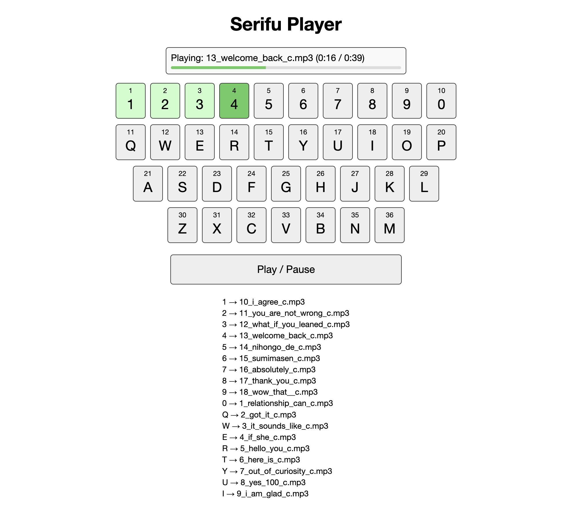

# Serifu Player:

**Serifu Player** is a lightweight, responsive soundboard for filmmakers. Trigger `.mp3` audio with a single key press or click—immediate, offline, and tactile. Originally built for playing absent actors’ lines (セリフ/serifu) during rehearsals or phone-call scenes, but flexible enough for any audio-triggering use.

## Requirements

- A modern browser (Chrome recommended)
- `.mp3` audio files

---

## 1. Getting the App

To download the app:

1. Click the green **Code** button at the top of this page.
2. Select **Download ZIP**.
3. Once downloaded, double-click the ZIP file to unzip it.
4. Move the unzipped folder wherever you like.

## 2. Add Audio Files

Open the `audio` folder. Drop your `.mp3` files in.

Only files in the top level of `audio/` are used. To hide clips, move them into subfolders.

## 3. Refresh the App

Double-click `refresh_audio_files.command` any time you add or remove audio files.
This script regenerates `assets/audioFiles.js`, which the app uses to map keys to clips.

## 4. Use the App

Double-click `serifu-player.html` to launch the app in your browser.

Tap a key or click a button and your audio plays instantly. Hit the spacebar to pause or resume.

## 5. Details

- Only the first 36 files are used, sorted by filename.
- Keys with no assigned audio show red.
- The top bar shows what's playing.

## Recap

- Put `.mp3` files in `audio/`.
- Use subfolders to hide files.
- Run `refresh_audio_files.command` to update.
- Open `serifu-player.html` to play.

## License

This project is released under [The Unlicense](http://unlicense.org/).
